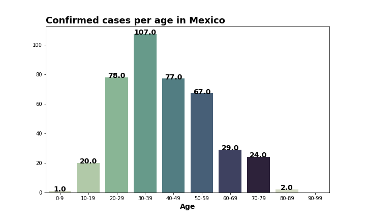
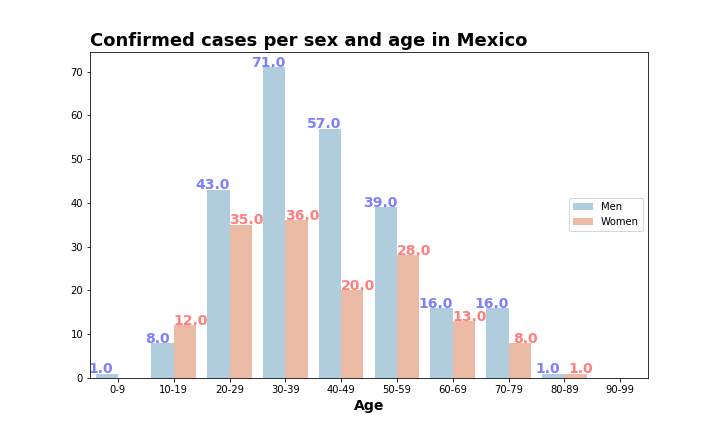
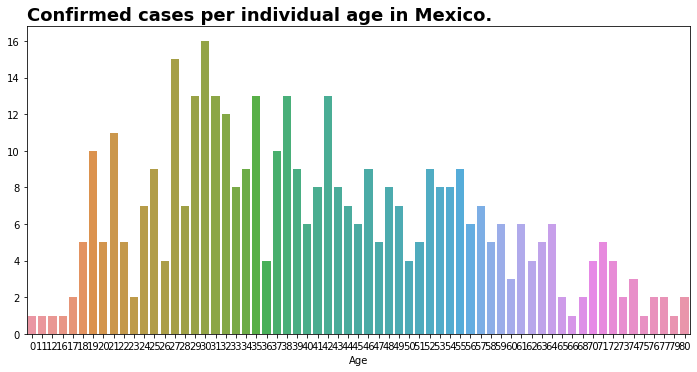

# COVID-19
In this moment of time the world is going through a difficult stage, mainly in economy and health. It´s too much to say that, more than anything, this is caused because of the new virus 'Novel Coronavirus 2019' that causes the infectious disease 'COVID-19'.

Although this is most probably a transitory event, there are lifes at risk because of this. Even if there are 2 or 20,000, or 2 million lifes that could be taken away, this is the most important thing that the countries governments and the society should be caring about, in order to take actions to lower the negative impact and the time we will be in this contingency. 

To take actions we need to know the problem. The better we now it, the better and faster we can solve that problem. So, I've made this repo as a personal proyect to get to know the actual problem from my perspective and I hope that this could be helpful for someone.

If you have any comments or feedback please contact me by direct message or send me an email to **nietolo.carlos@gmail.com** I'll be a pleased to answer your questions or to recieve feedback from more experienced people than me.

In this repo there are 2 main **jupyter notebooks:**
## COVID-19.ipynb
* This notebook has the data from the [Johns Hopkins University repo](https://github.com/CSSEGISandData/COVID-19).
* There are several functions and classes in this notebook to help us get information of any country (or globaly) of the confirmed/deaths/recovered in an easy and fast way.
* Here also we clean the data from the [Johns Hopkins University repo](https://github.com/CSSEGISandData/COVID-19) daily reports.
> **Note:** Because of time issues (online classes and homeworks) this notebook is unfinished and 'dirty', I'll try to finish it by this week.

## COVID-19_MEXICO.ipynb
* Notebook with the data from the [Daily technical releases](https://www.gob.mx/salud/documentos/coronavirus-covid-19-comunicado-tecnico-diario-238449) of the **General Division of Emidemiology** of Mexico.
* Contains a small exploratory data analysis of the confirmed cases **per age and state** in Mexico with several charts that are displayed below.

---
## Data Sources:

**There are 2 data sources in this repo:**
* [Johns Hopkins University repo](https://github.com/CSSEGISandData/COVID-19) where there are daily reports of the confirmed, deaths and recovered cases in the world.
* [Daily technical releases](https://www.gob.mx/salud/documentos/coronavirus-covid-19-comunicado-tecnico-diario-238449) from the **General Division of Emidemiology** of the **Secretaría de Salud** of Mexico.
---

## Countries
In this directory we store **historic time series** and **historic predictions** of the different countries in our main DataFrame in the [COVID-19 notebook](https://github.com/CarlosDNieto/COVID-19/blob/master/COVID-19.ipynb).

#### Time Series
* **File names format:** ts_Country_yyyy-mm-dd.csv
* This directory is where we store the time series of the class ``Country()`` defined in the [COVID-19 notebook](https://github.com/CarlosDNieto/COVID-19/blob/master/COVID-19.ipynb)
* This Time Series are updated easily with the function ``export_time_series(country)`` defined in the notebook described above. 
> **Note:** The parameter ``country`` is a string of the name of the desired country to export.

#### Predictions
* Predictions are actually in an excel file, but in the next days I'll automate them in the [COVID-19 notebook](https://github.com/CarlosDNieto/COVID-19/blob/master/COVID-19.ipynb).
---
## Acknowledgements

* [Johns Hopkins University](https://github.com/CSSEGISandData/COVID-19) for making the data available for educational and academic research purposes.